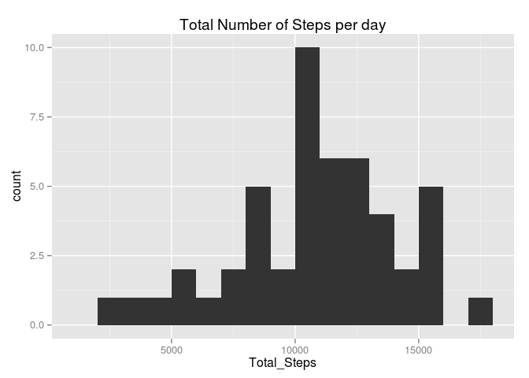
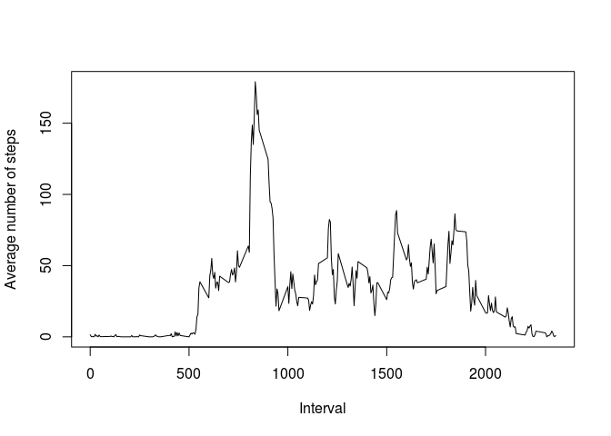

# Reproducible Research: Peer Assessment 1


## Loading and preprocessing the data


```r
data<-read.csv("~/Documents/activity.csv", stringsAsFactor = FALSE)
str(data)
```

```
## 'data.frame':	17568 obs. of  3 variables:
##  $ steps   : int  NA NA NA NA NA NA NA NA NA NA ...
##  $ date    : chr  "2012-10-01" "2012-10-01" "2012-10-01" "2012-10-01" ...
##  $ interval: int  0 5 10 15 20 25 30 35 40 45 ...
```

As you would notice the date variable is character. We would transform it into a date type


```r
data$date<-as.Date(data$date, format="%Y-%m-%d")
```


## What is mean total number of steps taken per day?

1. Calculate the total number of steps taken per day


```r
library(dplyr)
```

```
## 
## Attaching package: 'dplyr'
## 
## The following object is masked from 'package:stats':
## 
##     filter
## 
## The following objects are masked from 'package:base':
## 
##     intersect, setdiff, setequal, union
```

```r
data%>%
  group_by(date)%>%
  summarise(Total_Steps=sum(steps,na.rm=TRUE))
```

```
## Source: local data frame [61 x 2]
## 
##          date Total_Steps
## 1  2012-10-01           0
## 2  2012-10-02         126
## 3  2012-10-03       11352
## 4  2012-10-04       12116
## 5  2012-10-05       13294
## 6  2012-10-06       15420
## 7  2012-10-07       11015
## 8  2012-10-08           0
## 9  2012-10-09       12811
## 10 2012-10-10        9900
## ..        ...         ...
```

2. Histogram of the total number of steps taken each day


```r
library(ggplot2)
data%>%
  group_by(date)%>%
  summarise(Total_Steps=sum(steps,na.rm=TRUE))%>%
  ggplot(aes(Total_Steps)) + geom_histogram(binwidth=1000) + xlim(1000,18000) + 
  ggtitle("Total Number of Steps per day")
```

 

3. Mean and Median of the total number of steps taken per day


```r
stepdata<-data%>%
  group_by(date)%>%
  summarise(Total_Steps=sum(steps,na.rm=TRUE))
```
Mean Total Number of steps

```r
mean(stepdata$Total_Steps)
```

```
## [1] 9354.23
```

Median Total Number of Steps

```r
median(stepdata$Total_Steps)
```

```
## [1] 10395
```


## What is the average daily activity pattern?

1. Time series plot of the 5-minute interval (x-axis) and the average number of steps taken


```r
timeseries<-data%>%
  group_by(interval)%>%
  summarise(Average=(sum(steps, na.rm=TRUE)/61)) #61 is the total number of days between Oct and November

plot(x=timeseries$interval, y=timeseries$Average, type="l", xlab="Interval", ylab="Average number of steps")
```

 

2. The 5-minute interval that contains the maximum number of steps on average across all the days in the dataset, 


```r
timeseries<-data%>%
  group_by(interval)%>%
  summarise(Average=(sum(steps, na.rm=TRUE)/61))%>%
  arrange(desc(Average))

timeseries[1,1]
```

```
## Source: local data frame [1 x 1]
## 
##   interval
## 1      835
```

## Imputing missing values

1. Total number of missing values in the dataset

```r
length(which(is.na(data)))
```

```
## [1] 2304
```

2. New dataset with missing values filled with mean for that time interval


```r
newdata<-data%>%
  group_by(interval)%>%
  mutate(steps=ifelse(is.na(steps), mean(steps, na.rm=TRUE), steps))
  
newstepdata<-newdata%>%
  group_by(date)%>%
  summarise(total=sum(steps, na.rm=TRUE))
  
ggplot(data=newstepdata, aes(total))+geom_histogram(binwidth=1000)+ xlim(1000,18000)
```

 

```r
mean(newstepdata$total)
```

```
## [1] 10766.19
```

```r
median(newstepdata$total)
```

```
## [1] 10766.19
```

## Are there differences in activity patterns between weekdays and weekends?


```r
newdata$day<-ifelse(weekdays(newdata$date) %in% c("Saturday","Sunday"), "weekend", "weekday")

library(ggplot2)
newdata%>%
  group_by(interval,day)%>%
  summarise(avg_steps=mean(steps))%>%
  ggplot(aes(x=interval, y=avg_steps)) + geom_line()+facet_grid(day~.) + xlab("Interval")+ylab("Average Steps")
```

 
